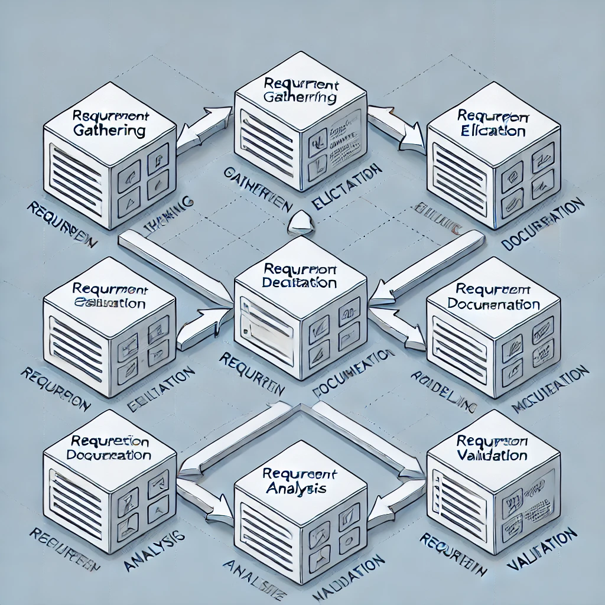

# Requirement Analysis in Software Development

## Purpose

This repository is dedicated to documenting and structuring requirements for a booking management system. It demonstrates the process of crafting a comprehensive foundation for software development through detailed requirement analysis.

## Why is Requirement Analysis Important?

Requirement Analysis is a crucial phase in the Software Development Life Cycle (SDLC) that lays the foundation for successful project execution. Here are three key reasons why it is essential:

1. **Clarity of Scope**

   - Defines what the system should and should not do, eliminating ambiguity.
   - Ensures alignment between stakeholders, developers, and users by providing a clear understanding of project objectives and deliverables.

2. **Risk Mitigation**

   - Identifies potential challenges and risks early in the development process.
   - Reduces the likelihood of costly revisions by addressing issues before implementation begins.

3. **Efficient Resource Utilization**
   - Enables precise estimation of time, effort, and resources required.
   - Ensures optimal use of team and technological resources by setting clear priorities.

By investing in robust Requirement Analysis, teams can improve project success rates, minimize errors, and deliver systems that meet user expectations effectively.

## Key Activities in Requirement Analysis

Requirement Analysis involves a series of systematic activities to ensure the successful definition and documentation of project requirements. Here are the five key activities:

- **Requirement Gathering**

  - Collect initial inputs from stakeholders, users, and other sources.
  - Focus on understanding high-level needs and expectations for the system.

- **Requirement Elicitation**

  - Use techniques like interviews, workshops, surveys, and observations to uncover detailed requirements.
  - Engage stakeholders to ensure all relevant requirements are identified.

- **Requirement Documentation**

  - Record gathered requirements in a structured and clear format.
  - Create comprehensive documents such as a Software Requirement Specification (SRS).

- **Requirement Analysis and Modeling**

  - Analyze and prioritize requirements based on feasibility, risks, and business goals.
  - Use tools and techniques like flowcharts, use case diagrams, or data models to represent requirements visually.

- **Requirement Validation**
  - Verify that documented requirements align with stakeholder needs and project objectives.
  - Ensure that requirements are clear, consistent, and testable.

These activities collectively form the backbone of successful Requirement Analysis, enabling the development of reliable and scalable software systems.

## Types of Requirements

In software development, requirements are categorized into two main types: Functional and Non-functional Requirements. Below is an explanation of each, along with examples tailored to the booking management project.

### Functional Requirements

**Definition:**
Functional requirements describe what the system should do. They specify the features and functionalities that fulfill user needs and business objectives.

**Examples for the Booking Management Project:**

- Users can create, modify, and cancel bookings through the system.
- The system sends email notifications to users for booking confirmations and cancellations.
- Administrators can manage room availability and block rooms for maintenance.
- Users can search for available rooms using filters like date, price, and type of room.
- The system processes payments securely and generates invoices for bookings.

---

### Non-functional Requirements

**Definition:**
Non-functional requirements define the quality attributes, constraints, or standards the system must adhere to. They focus on how the system performs its functions.

**Examples for the Booking Management Project:**

- **Performance:** The system should handle up to 1,000 simultaneous booking requests.
- **Scalability:** The system must support an increase in users and bookings without performance degradation.
- **Security:** All user data, including payment information, must be encrypted using industry-standard protocols.
- **Usability:** The interface should be user-friendly and accessible for both mobile and desktop users.
- **Availability:** The system must have 99.9% uptime to ensure round-the-clock access for users.

By distinguishing between functional and non-functional requirements, we ensure the system is both effective in delivering its core functionality and reliable in meeting quality expectations.

## Use Case Diagrams

**Definition:**
A Use Case Diagram is a visual representation of the interactions between actors (users or other systems) and the use cases (functionalities) of a system. It helps in understanding system behavior and identifying key functionalities.

**Benefits:**

- Simplifies communication between stakeholders and developers.
- Provides a high-level overview of system interactions.
- Identifies the roles and responsibilities of actors.

**Example Use Case Diagram:**
Below is a Use Case Diagram for the booking management system:

## Acceptance Criteria

**Definition:**
Acceptance Criteria are a set of predefined conditions that a feature or functionality must meet to be considered complete and satisfactory. They ensure that all stakeholders have a clear understanding of what the feature is intended to achieve.

**Importance:**

- Provides a clear definition of done for development and testing.
- Ensures alignment between stakeholders, developers, and testers.
- Facilitates the creation of test cases to validate feature functionality.
- Reduces ambiguity and minimizes the risk of miscommunication.

**Example: Checkout Feature in the Booking Management System**

**Feature Description:**
The Checkout feature allows users to complete their booking by making payments and receiving a confirmation.

**Acceptance Criteria:**

1. The system should display a summary of the booking, including room details, dates, and total cost.
2. Users must be able to select a payment method (credit card, PayPal, etc.).
3. Payment should be processed securely, and sensitive data must be encrypted.
4. Upon successful payment, a confirmation page must be displayed with the booking reference number.
5. An email confirmation should be sent to the user with the booking details.
6. If payment fails, an error message should be displayed, and the user must be allowed to retry or choose a different payment method.

By defining clear and testable Acceptance Criteria, teams can ensure that the feature meets user expectations and business requirements effectively.
